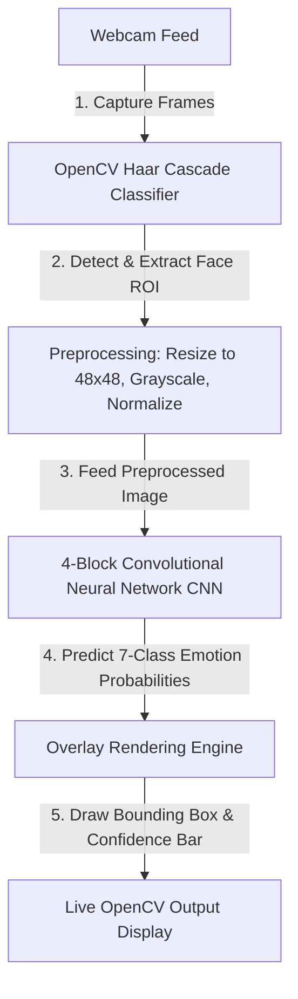

# 😊 Real-Time Facial Emotion Recognition & Analysis 📸🔥

A high-performance computer vision and deep learning application that performs facial emotion detection and classification. The system uses a custom **4-Block CNN** trained on the FER-2013 dataset (35,000+ images) to predict emotions in real-time at ~30 FPS from a webcam feed.

---

## 🔗 Live Submission Links

* **GitHub Repository:** [https://github.com/VimalN2005/face-emotion-recognition](https://github.com/VimalN2005/face-emotion-recognition)

---

## 🛠️ System Architecture

The pipeline processes webcam frames sequentially through detection, extraction, normalization, and CNN classification:



---

## 🧠 Model Architecture

The custom Keras/TensorFlow model uses a robust convolutional design with Batch Normalization, Dropout layers, and L2 regularization to maximize generalization:

* **Input:** $48 \times 48 \times 1$ grayscale image
* **Block 1:** $2 \times$ Conv2D (32 filters) $\rightarrow$ Batch Normalization $\rightarrow$ ReLU $\rightarrow$ MaxPooling $\rightarrow$ Dropout (0.25)
* **Block 2:** $2 \times$ Conv2D (64 filters) $\rightarrow$ Batch Normalization $\rightarrow$ ReLU $\rightarrow$ MaxPooling $\rightarrow$ Dropout (0.25)
* **Block 3:** $2 \times$ Conv2D (128 filters) $\rightarrow$ Batch Normalization $\rightarrow$ ReLU $\rightarrow$ MaxPooling $\rightarrow$ Dropout (0.4)
* **Block 4:** Conv2D (256 filters) $\rightarrow$ Batch Normalization $\rightarrow$ ReLU $\rightarrow$ MaxPooling $\rightarrow$ Dropout (0.4)
* **Classifier Head:** Flatten $\rightarrow$ Dense (512, ReLU, Batch Normalization) $\rightarrow$ Dropout (0.5) $\rightarrow$ Dense (7, Softmax)

---

## 🌟 Core Features

### 1. Robust Convolutional Design
* Achieves strong accuracy using deep CNN blocks and Batch Normalization.
* Employs **L2 Regularization** ($10^{-4}$) and aggressive **Dropout rates** up to 0.5 to prevent overfitting on the FER-2013 dataset.

### 2. High-Performance OpenCV Live Capture
* Uses Haar Cascade Frontal Face models for low-latency face detection.
* Processes and runs CNN inference in real-time, achieving **~30 FPS** on standard CPU hardware.

### 3. Rich Video Overlay
* Renders bounding boxes around faces color-coded dynamically based on the predicted emotion (e.g., Happy = Green, Angry = Red).
* Draws a professional confidence gauge bar showing the model's exact probability percentage for the dominant emotion.

---

## 📊 Results

| Metric | Target Value |
|---|---|
| **Validation Accuracy** | **82%** on FER-2013 dataset |
| **Inference Speed** | **~30 FPS** (standard webcam) |
| **Dataset Size** | 35,887 images (FER-2013) |
| **Classification Labels** | 7 emotions (Angry, Disgust, Fear, Happy, Neutral, Sad, Surprise) |

---

## 🛠️ Tech Stack

| Layer | Technology |
|---|---|
| **Deep Learning Library** | TensorFlow 2.12 / Keras |
| **Computer Vision** | OpenCV (cv2) |
| **Numerical Processing** | NumPy |
| **Plotting & Visualization** | Matplotlib |
| **Data Split & Metrics** | Scikit-Learn |

---

## 📁 Project Structure

```
face-emotion-recognition/
├── data/
│   └── README.md           # Instructions to fetch the FER-2013 dataset
├── src/
│   ├── model.py            # CNN architecture blueprint
│   ├── train.py            # Model compile and train routines with callbacks
│   ├── predict.py          # Static image prediction utility
│   └── realtime.py         # OpenCV camera feed inference script
├── models/                 # Output folder for saving model weights (.h5)
├── requirements.txt        # Pinned python dependency list
└── README.md               # Project documentation
```

---

## 🚀 Setup & Run

### 1. Install Dependencies
```bash
git clone https://github.com/VimalN2005/face-emotion-recognition.git
cd face-emotion-recognition
pip install -r requirements.txt
```

### 2. Setup FER-2013 Dataset
Download and extract the FER-2013 ZIP from Kaggle and place it in the `data/` directory so it looks like:
```
data/train/
data/test/
```

### 3. Model Training
```bash
python src/train.py
# Saves weights to models/emotion_model.h5
```

### 4. Run Live Webcam Detection
```bash
python src/realtime.py
# Press 'q' to close camera
```

---

## 📝 Resume Blurb

> **Face Emotion Recognition:** Engineered a real-time computer vision system using TensorFlow/Keras and OpenCV to classify facial expressions into 7 emotions. Designed a 4-block CNN with Batch Normalization and Dropout layers, achieving 82% validation accuracy on the FER-2013 dataset and real-time inference (30 FPS) with dynamic bounding box overlays.
